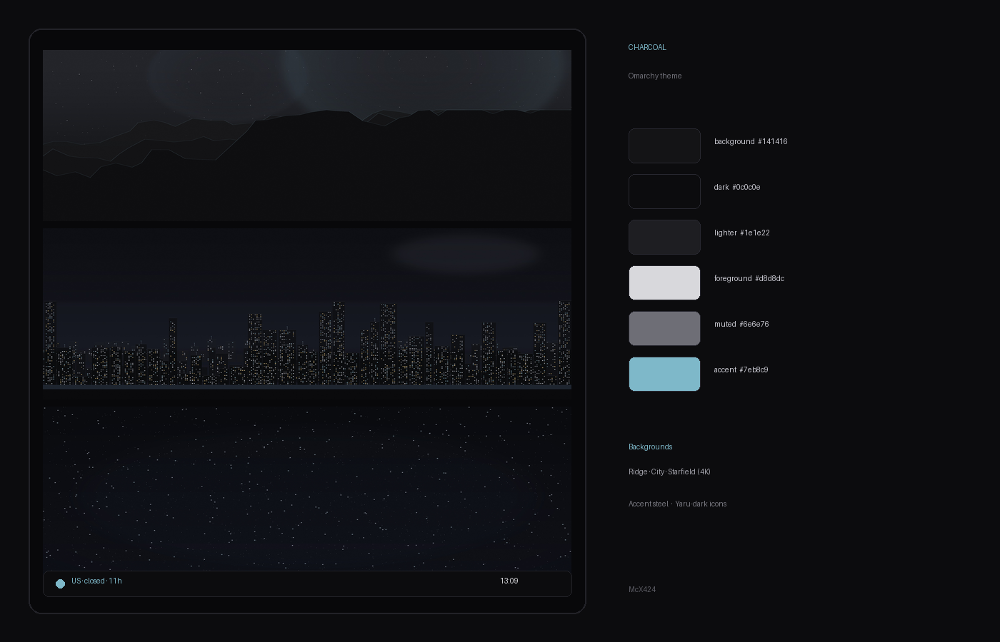

# Charcoal

A clean charcoal [Omarchy](https://omarchy.org) theme — soft graphite surfaces, cool steel accent, and three 4K wallpapers.



## Install

```bash
omarchy theme install https://github.com/McX424/omarchy-charcoal-theme.git
```

Or: **Omarchy menu → Install → Style → Theme** and paste that URL.

The theme appears as **Charcoal** in the selector.

## What’s included

| Piece | Detail |
|-------|--------|
| Palette | Graphite greys + steel accent `#7eb8c9` |
| Icons | `Yaru-dark` |
| Lock screen | `shell.lock.toml` + unlock art |
| Keyboard RGB | Steel accent |
| Wallpapers (4K) | Ridge · City · Starfield |

## Wallpapers

Cycle with Style wallpaper next / `omarchy-theme-bg-next`.

| File | Mood |
|------|------|
| `01-ridge.jpg` | Layered ridgeline under a steel sky |
| `02-city-haze.jpg` | Dark city skyline with lit windows |
| `03-starfield.jpg` | Dense charcoal night sky |

## Palette

| Token | Hex |
|-------|-----|
| background | `#141416` |
| dark_background | `#0c0c0e` |
| lighter_background | `#1e1e22` |
| foreground | `#d8d8dc` |
| dark_foreground / muted text | `#6e6e76` |
| accent | `#7eb8c9` |
| selection | `#2a2a32` |

Terminal ANSI colours stay desaturated so code stays readable without neon noise.

## Remove

```bash
omarchy theme remove charcoal
```

(Or **Remove → Style → Theme** in the Omarchy menu.)

## Notes for distributors

- Repo naming follows `omarchy-[name]-theme` so install shows as **Charcoal**.
- No `neovim.lua` / `vscode.json` / terminal configs — Omarchy regenerates those from `colors.toml` for installed themes.
- Optional: list on the [extra themes](https://omarchy.org) page via a PR to the omarchy-site repo.

## License

MIT © McX424
